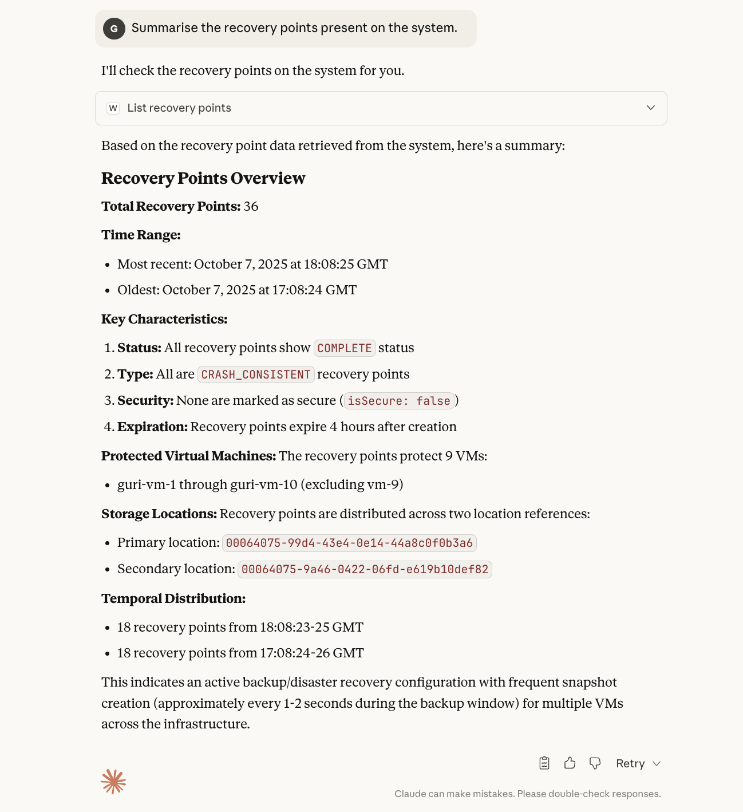
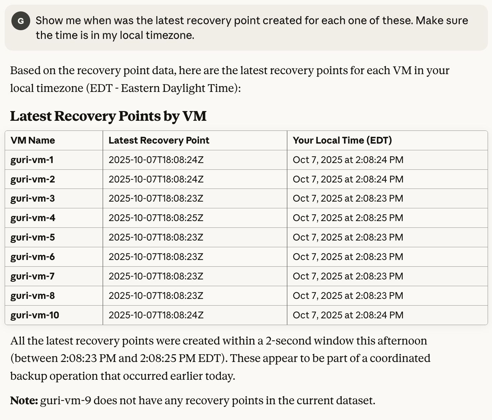

## Implementation of a Sample MCP Server that understands the DR V4 APIs.

## Setup Instructions

### Clone this repo:
- `git clone git@github.com:gurwinder-nutanix/dr-demo-mcp-server.git`

### Install the required node modules:
- `npm install`

Assumption: Node is already installed on the local setup.

### Setup the Agent to point to the MCP Server:
Assumed Environment: Macbook user trying to setup this MCP Server with Claude desktop app (This step will not work for other configurations)

- Add a new entry to the claude desktop config file, sample path: `/Users/gurwinder.singh/Library/Application Support/Claude/claude_desktop_config.json`
- Replace the `args` with full path to your mcp server.

```json
{
  "mcpServers": {
    "server-name": {
      "command": "node",
      "args": ["/Users/gurwinder.singh/Workspace/playground/llm-projects/mcp-server-01/weather-server.js"],
      "env": {
        "V4_API_KEY": "<Basic-Auth-V4-API-Key>"
      }
    }
  }
}
```

### Run the server:
- `npm start`

### We are ready to run the Claude Desktop App which should now understand the DR V4 APIs. Some of the examples are shown below.


## Example Prompt 1:
Summarise the recovery points present on the system.



## Example Prompt 2:
Show me when was the latest recovery point created for each one of these. Make sure the time is in my local timezone.


## Demo Video of sample interaction with Agent:

<video width="640" height="480" controls>
  <source src="./images/List-Recovery-Points-demo.mp4" type="video/mp4">
  Your browser does not support the video tag.
</video>
